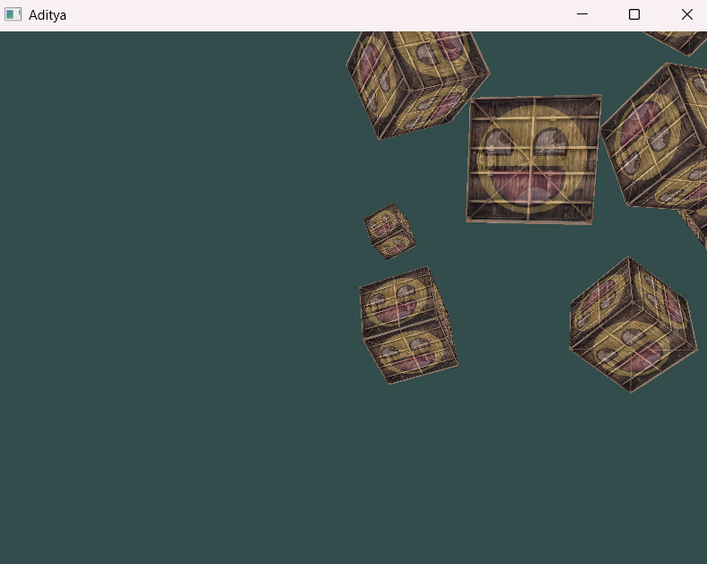

# Learning OpenGL

This project demonstrates how to render textured 3D cubes using modern OpenGL with camera movement, perspective projection, and texture blending. It is a foundational exercise for learning real-time 3D rendering and shader-based graphics programming.

## ✨ Features

- Renders 10 textured cubes in 3D space
- First-person camera navigation (`W`, `A`, `S`, `D`)
- Mouse-controlled camera yaw/pitch
- Scroll wheel zoom (FOV control)
- GLM-based matrix transformations (model, view, projection)
- Fragment shader-based texture blending
- Depth testing for correct 3D rendering

## 🖼 Preview

>
> Example:
>
> 


## 🧰 Dependencies

You’ll need the following libraries:

- [GLFW](https://www.glfw.org/) – Window/context creation and input handling
- [GLAD](https://glad.dav1d.de/) – OpenGL function loader
- [GLM](https://github.com/g-truc/glm) – OpenGL Mathematics
- [STB Image](https://github.com/nothings/stb) – Image loading library

## 🔧 Build Instructions

### Linux/macOS

Make sure all dependencies are installed and linked properly.

```bash
g++ main.cpp -o LearningOpenGL -lglfw -ldl -lGL
./LearningOpenGL
```
## 📚 Concepts Covered

This project touches on a wide range of OpenGL and graphics programming fundamentals:

- **GLFW Initialization**  
  Create an OpenGL context and handle input and window events.

- **GLAD Loading**  
  Load modern OpenGL function pointers dynamically.

- **Shader Programming**  
  Use custom vertex and fragment shaders. Pass uniforms such as transformation matrices and texture units.

- **VAO/VBO Usage**  
  Understand how to upload and organize vertex data using Vertex Buffer Objects (VBOs) and Vertex Array Objects (VAOs).

- **Camera System**  
  Implement a free-look camera using:
  - Yaw, pitch, and FOV (Field of View) controls
  - `glm::lookAt` for view matrix
  - Scroll and mouse callbacks

- **Transformation Matrices**  
  Apply transformations using:
  - Model matrix for positioning individual cubes
  - View matrix for simulating camera movement
  - Projection matrix for perspective projection

- **Texture Mapping**  
  Load images with `stb_image` and apply them as 2D textures. Use multiple textures and mix them in the fragment shader.

- **Depth Testing**  
  Enable depth buffering to correctly render 3D scenes with overlapping geometry.

- **Input Handling**  
  Capture keyboard input to control camera movement (`W`, `A`, `S`, `D`), mouse for looking around, and scroll wheel for zoom.

- **Real-Time Rendering Loop**  
  A loop that handles input, updates frame timing, clears buffers, and draws all objects per frame.


